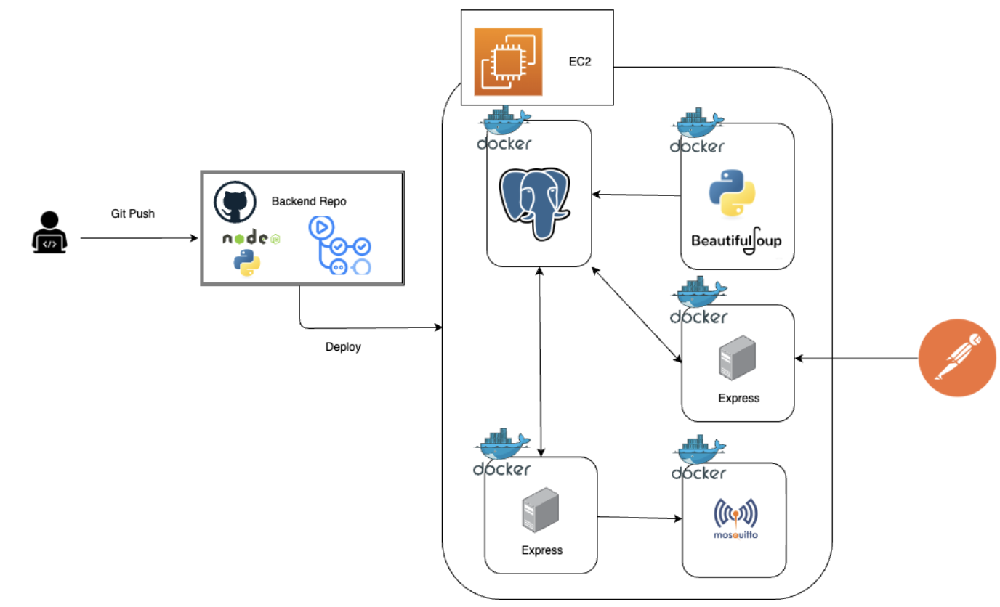

# README(JobSubPub)

---

## 系統簡介

JobSubPub旨在自動化地從職缺網站爬取職缺資料，並根據使用者的訂閱條件，通過MQTT推播服務，實時或定時向外部服務傳送通知。此系統採用分散式架構設計，能夠有效地處理大量資料並保障高效能的推播服務。


## **技術棧**

---

- **程式語言**: Python、Node.js
- **資料庫**: PostgreSQL
- **其他**: Socket.IO、Mosquitto (MQTT)、Docker、Prometheus、Grafana

## **系統功能**

---

**1. 定時職缺爬取與更新**
- 爬蟲系統定時從多個職缺網站（104、1111）爬取資料，更新到資料庫中。
  
**2. 使用者訂閱推播服務**
- 使用者可訂閱特定公司或特定職缺來實時取得通知
- 使用者可用模糊的訂閱條件來讓系統定時推播通知

**3. 系統監控與日誌**
- 簡易指標監控系統運行狀態


## **系統架構圖**

---


- **爬蟲引擎**  
  - 使用Python編寫，定時爬取常見職缺網站的職缺資料並更新到資料庫中。
  
- **資料庫**  
  - 選用PostgreSQL儲存職缺資料和使用者的訂閱資訊。
  - 資料庫主要包含職缺表、訂閱表以及推播表，並利用PostgreSQL的JSONB和trigger特性實現動態欄位設計與推播通知。

- **應用伺服器**  
  - 使用Node.js編寫，分為Job Service和Publish Service。
  - Job Service處理職缺查詢和訂閱操作，
  - Publish Service負責根據資料庫更新或定時條件推播消息。

- **外部服務與通知模組**  
  - 外部服務透過RESTful API與應用伺服器互動，並使用Socket.IO即時向使用者推送通知，實現訂閱內容的即時顯示。
  - 額外設置 https://github.com/YiHsinTseng/NotificationSystem

- **監控與日誌記錄**  
  - 系統的可觀測性由Prometheus與Grafana提供，設置簡易監控指標，確保系統穩定運行。

## **系統運行**

---

1. 克隆項目到本地：

    ```bash
    git clone https://github.com/YiHsinTseng/JobSubPub.git
    ```

2. 移動到Docker資料夾：

    ```bash
    cd Docker
    ```

3. 執行Docker指令運行：

    ```bash
    docker-compose up --build
    ```

